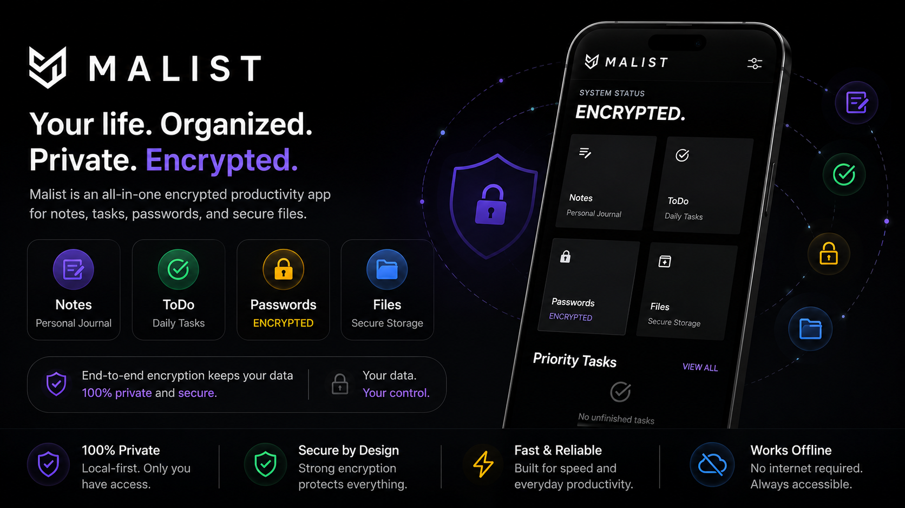

<p align="center">
  
</p>

<h1 align="center">M A L I S T</h1>

<p align="center">
<strong>Focused. Local. Secure.</strong><br>
A minimalist, local-first personal organizer—built for privacy, offline autonomy, and the true-black visual aesthetic.
</p>

<p align="center">
  <a href="https://github.com/jheel23/malist/releases/latest">
    
  </a>
</p>

<p align="center">
  <a href="https://github.com/jheel23/malist">
    
  </a>
  <a href="https://github.com/jheel23/malist/issues/new?template=bug_report.md">
    
  </a>
  <a href="https://github.com/jheel23/malist/issues/new?template=feature_request.md">
    
  </a>
</p>

<p align="center">
  
  
  
  
</p>

---

## 📖 Overview

**Malist** is a local-first personal organizer designed from the ground up for individuals who prioritize absolute privacy, digital sovereignty, and distraction-free writing. Styled with a terminal-like true-black aesthetic, the app runs completely sandbox-isolated, storing and encrypting all user-generated data locally.

### Core Philosophy
* **Zero Cloud Dependence**: Your data never leaves your device unless you explicitly export it. No external servers, trackers, or telemetries.
* **True-Black OLED Styling**: Elegant minimal interface incorporating terminal terminal-style typewriter animations (Courier fonts) combined with Outfit typography.
* **Security**: Seamless on-device database encryption layered with strong client-side user-controlled backup encryption.

---

## 🗂️ Table of Contents

1. [Features](#-features)
2. [Cryptographic & Storage Architecture](#-cryptographic--storage-architecture)
3. [Technology Stack](#-technology-stack)
4. [Project Structure](#-project-structure)
5. [Getting Started](#-getting-started)
6. [Platform Support](#-platform-support)
7. [Roadmap](#-roadmap)
8. [Contributing](#-contributing)
9. [Acknowledgements](#-acknowledgements)
10. [License](#-license)

---

## ⚡ Features

* 📝 **Personal Notes (Journal)**: Write distraction-free journal logs or Markdown notes using a built-in rich-text editor (`flutter_quill`).
* ✅ **ToDo (Daily Tasks)**: Check off list items, categorize priorities, and organize daily goals in a minimal list format.
* 🔑 **Passwords (Encrypted Credentials)**: Store accounts, secrets, and login credentials securely inside a password manager.
* 📁 **Secure Files Vault**: Import and organize local files (PDFs, Images, Audio, and Video) with built-in sandbox viewers.
* 💾 **Configurable Backups**:
  * Auto-backups (Daily, Weekly, Monthly) run silently in the background on app launch.
  * Robust AES-256 zip archive export secured with a user-defined password.
  * Device migration warnings reminding users to export their data before switching devices or uninstalling app.

---

## 🔒 Cryptographic & Storage Architecture

Malist employs two layers of defense to secure database entries and file attachments.

```
                  ┌────────────────────────────────────────┐
                  │          Malist Architecture           │
                  └───────────────────┬────────────────────┘
                                      │
           ┌──────────────────────────┴──────────────────────────┐
           ▼                                                     ▼
┌──────────────────────┐                              ┌──────────────────────┐
│Database Cryptography │                              │ Backup Cryptography  │
└──────────┬───────────┘                              └──────────┬───────────┘
           │                                                     │
           ▼                                                     ▼
┌──────────────────────┐                              ┌──────────────────────┐
│  ToStore Database    │                              │ User Custom Password │
│ (Built for security) │                              └──────────┬───────────┘
└──────────┬───────────┘                                         │
           │                                                     ▼
           ▼                                          ┌──────────────────────┐
┌──────────────────────┐                              │  PBKDF2-like KDF     │
│Master Key Generation │                              │ (HMAC-SHA256 x10k)   │
└──────────┬───────────┘                              └──────────┬───────────┘
           │                                                     │
           ▼                                                     ▼
┌──────────────────────┐                              ┌──────────────────────┐
│FlutterSecureStorage  │                              │    Derived 256-Bit   │
│  (OS Keychain/Vault) │                              │    Encryption Key    │
└──────────────────────┘                              └──────────┬───────────┘
                                                                 │
                                                                 ▼
                                                      ┌──────────────────────┐
                                                      │  AES-256-CBC Cipher  │
                                                      │    (Random IV/Salt)  │
                                                      └──────────┬───────────┘
                                                                 │
                                                                 ▼
                                                      ┌──────────────────────┐
                                                      │ Encrypted Zip Archive│
                                                      │(DB JSON + Media Files│
                                                      └──────────────────────┘
```

### 1. Database Cryptography
* All records are kept inside a **ToStore** database (`ToStore.open`), running with native document engine schemas.
* The database is protected using transparent file-level encryption. A cryptographically secure random Master Key is generated upon the first boot of the application.
* The Master Key is stored safely in platform keychain systems (Android KeyStore and iOS Keychain) via `flutter_secure_storage`.

### 2. Backup Cryptography (`EncryptionHelper`)
* **Key Derivation**: When exporting a backup, the app generates a unique random `16-byte salt`. The user's custom backup password is run through a custom Key Derivation Function (KDF) using `10,000 iterations` of a `SHA-256 HMAC` to derive a secure 256-bit encryption key.
* **Payload Encryption**: Database tables (`notes`, `todos`, `passwords`, `files`) are dumped to JSON, combined with metadata, and encrypted using **AES-256 in CBC mode** with PKCS7 padding and a random 16-byte Initialization Vector (IV).
* **Archive Packaging**: The encrypted database payload, encrypted manifest metadata, and imported media vault attachments are compressed into a unified `.zip` archive.
* **Auto-Backup Scheduler**: The backup password is saved locally in secure storage, letting the scheduler run `checkAndRunScheduledBackup()` on app startup to verify frequency policies (daily/weekly/monthly) and back up files seamlessly in the background.

---

## 🛠️ Technology Stack

* **State Management**: `flutter_riverpod` (Notifier, AsyncNotifier, and FutureProvider paradigm).
* **Database & Cache**: `tostore` with custom database-level encryption.
* **Routing**: `go_router` supporting seamless deep-linking and state navigation.
* **Dependency Injection**: `get_it` service locator pattern.
* **Local Keychain**: `flutter_secure_storage`.
* **Utility Libraries**:
  * `encrypt` & `crypto` for AES encryption and PBKDF2 operations.
  * `flutter_quill` for the rich-text note editor.
  * `audioplayers` & `video_player` for custom media renderers.
  * `syncfusion_flutter_pdfviewer` for rendering documents.
  * `archive` for packing backups.

---

## 📂 Project Structure

```text
lib/
├── config/              # App configurations, GoRouter, themes, and global constants
│   ├── router/          # Declared route controllers (app_router.dart)
│   └── theme/           # UI styles (true black theme configurations)
├── core/                # Global utilities, failures, constants
│   ├── constants/       # Asset definitions, db schemas, storage keys
│   ├── failures/        # App-wide exception models
│   └── utils/           # EncryptionHelper (AES-256 engine)
├── data/                # Data access layers, repositories, and local services
│   ├── models/          # Data representations (freezed structures)
│   ├── repository/      # Domain repository implementation (CoreServiceRepo)
│   └── source/          # Low-level DB configurations (DatabaseService, BackupStorageService)
├── providers/           # Riverpod state managers (backup, todo, notes, files, passwords)
├── views/               # Presentation UI components
│   ├── screens/         # Page entry points (home, settings, backup, folders)
│   └── widgets/         # Shared visual components and dialog boxes
├── main.dart            # Flutter application entry point
└── service_locator.dart # GetIt dependency injection setup
```

---

## 🚀 Getting Started

### Prerequisites
* Flutter SDK `^3.11.4`
* Dart SDK `^3.11.4`
* Cocoapods (for iOS deployment) - **Deprecated** will no longer be relavant in upcoming Flutter Releases as they are completly migrating to use **Swift Package Manager**.

### Installation
1. **Clone the repository:**
   ```bash
   git clone https://github.com/jheel23/malist.git
   cd malist
   ```

2. **Install dependencies:**
   ```bash
   flutter pub get
   ```

3. **Generate code bindings:**
   Run `build_runner` to generate Freezed, Json Serializable, and GoRouter route structures:
   ```bash
   dart run build_runner build --delete-conflicting-outputs
   ```

4. **Run the app:**
   ```bash
   flutter run
   ```

---

## 📱 Platform Support

| Platform | Support Status | Notes |
|----------|----------------|-------|
| **Android** | ✅ Supported | Requires minSdk 21, uses KeyStore for encryption keys. |
| **iOS** | ✅ Supported | Requires iOS 12.0+, uses Keychain services. |
| **macOS** | ⚠️ Unofficial | Not actively tested. |
| **Windows** | ⚠️ Unofficial | Not actively tested. |
| **Linux** | ⚠️ Unofficial | Not actively tested. |

---

## 🗺️ Roadmap

- [x] True-Black OLED UI styling
- [x] Document & Journaling Vault (Quill support)
- [x] Secure Password/Credentials Vault
- [x] File Attachment Management (PDF, Images, Audio, Video)
- [x] Client-Side Custom AES-256 Encrypted Backups
- [x] Scheduled Auto-Backups (on app launch)
- [x] Warning Widget & Weekly Migration Reminders
- [ ] Multi-device Cloud Sync (End-to-End Encrypted)
- [ ] Desktop Support (macOS / Windows)

---

## 🤝 Contributing

Contributions are welcome! Please follow these guidelines:

1. Fork the project and create your feature branch:
   ```bash
   git checkout -b feature/<TITLE-OF-THE-FEATURE>
   ```
2. Make your modifications. Remember to run code generator if you edit models:
   ```bash
   dart run build_runner build --delete-conflicting-outputs
   ```
3. Format your changes:
   ```bash
   dart format .
   ```
4. Push to the branch and submit a Pull Request.

> [!IMPORTANT]
> **Architecture Guideline**: Keep layers clean and separated (Views ──► Providers ──► Repositories ──► Data Sources). Pull requests that break architecture boundaries or leak data source states into the UI will not be approved.

---

## 💖 Acknowledgements

* [Riverpod](https://riverpod.dev) - State management engine.
* [ToStore](https://pub.dev/packages/tostore) - Local embedded database.
* [Encrypt](https://pub.dev/packages/encrypt) - Cryptographic helpers.
* [GoRouter](https://pub.dev/packages/go_router) - Declarative router.

---

## ⚖️ License

This project is licensed under the **GNU General Public License v3.0**.

Malist is free software: you can redistribute it and/or modify it under the terms of the GNU General Public License as published by the Free Software Foundation. If you modify and distribute this software, you must release your modified version under the same GPLv3 license.

See the [LICENSE](LICENSE) file for more details.
